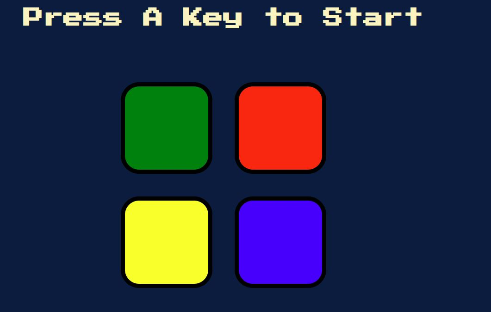

# 🧠 Chroma Memory 🧠

## <ins>Description</ins>
Chroma Memory is an entertaining and challenging activity that exercises the brain's memory capabilities, concentration, and cognitive skills. It can be played individually to beat personal best scores or enjoyed as a competitive game with multiple players aiming to achieve the highest level of accuracy and recall.

## <ins>How to play</ins>
1. To initiate the game, you can press any key.

2. The game begins by presenting a sequence of colors to the players. There will be 1 color that is highlighted and a sound will be made. 

3. The players need to carefully observe and remember the order in which the colors are presented. Each level will only represent the newest color. You must remember the older ones.

4. After the new color is displayed, the players must then attempt to reproduce the sequence of colors from memory, matching the exact order in which they were originally shown.

5. To reproduce the sequence, the players take turns indicating the colors one by one, starting from the first color in the sequence. They can do this by clicking each color in order. 

6. If a player correctly recalls the entire sequence of colors in the correct order, they continue to the next level, where the sequence becomes longer and more challenging.

7. If a player makes a mistake by recalling the colors in the wrong order or forgetting a color from the sequence, it will be game over.

8. The game continues with increasingly longer and more complex color sequences, testing the players' memory and ability to recall the order accurately.

## <ins>Website Showcase</ins>
### Click here to play: [Chroma Memory Master](https://tiomeko.github.io/simon-says/)

